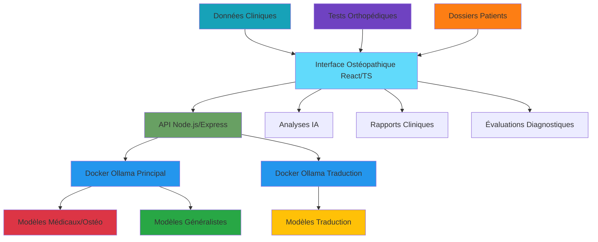

# 🩺 Medical LLM Platform - Analyse IA pour Ostéopathie

> Plateforme d'intelligence artificielle dédiée à l'analyse de données cliniques ostéopathiques et l'évaluation des tests orthopédiques. Projet de mémoire universitaire en ostéopathie.

[](https://www.typescriptlang.org/)
[](https://reactjs.org/)
[](https://docker.com)
[](https://vercel.com)

## 🎯 Contexte du Projet

**Mémoire d'Ostéopathie** - Cette recherche évalue la capacité des modèles d'intelligence artificielle à analyser les données cliniques ostéopathiques et à interpréter les tests orthopédiques. L'objectif est de déterminer si les LLM peuvent assister les praticiens dans l'analyse de cas cliniques tout en respectant la confidentialité des données patients.

### 🏥 Problématique de Recherche

> **"Les modèles de langage (LLM) peuvent-ils analyser efficacement les données cliniques ostéopathiques et interpréter les tests orthopédiques de manière fiable et sécurisée ?"**

Cette plateforme permet de tester cette hypothèse en proposant une infrastructure **100% locale** et sécurisée pour l'analyse de données cliniques sans compromettre la confidentialité des informations patients.

### ✨ Fonctionnalités Principales

- 🦴 **Analyse de Données Cliniques** - Traitement des dossiers patients ostéopathiques
- 🧪 **Évaluation Tests Orthopédiques** - Interprétation IA des tests manuels
- 🏥 **11 Modèles LLM** dont 4 spécialisés médecine + ostéopathie
- 🔒 **Déploiement 100% Local** - Aucune donnée clinique envoyée vers le cloud
- 📊 **Benchmarking Clinique** - Évaluation de la précision diagnostique IA
- 🌐 **Interface Ostéopathique** - React/TypeScript adaptée aux praticiens
- ⚡ **API REST Médicale** - Communication sécurisée avec données patients
- 📈 **Analytics Cliniques** - Statistiques d'efficacité thérapeutique

## 🏗️ Architecture



## 🚀 Démarrage Rapide

### Prérequis

- **Node.js** 18+ ([télécharger](https://nodejs.org/))
- **Docker Desktop** ([télécharger](https://www.docker.com/products/docker-desktop))
- **Git** ([télécharger](https://git-scm.com/))

### Installation

```bash
# 1. Cloner le repository
git clone https://github.com/votre-username/medical-llm-platform.git
cd medical-llm-platform

# 2. Installer les dépendances
npm install

# 3. Démarrer les services Docker
docker-compose up -d

# 4. Installer les modèles IA (première fois uniquement)
npm run setup:models

# 5. Démarrer l'application
npm run dev
```

🎉 **L'application est maintenant accessible sur http://localhost:3000**

## 📦 Structure du Projet

```
medical-llm-osteopathy/
├── 📱 app/                    # Application Next.js/React
│   ├── components/           # Composants UI ostéopathiques
│   │   ├── TestsOrthopediques/ # Interface tests manuels
│   │   ├── AnalyseClinique/   # Analyse données patients
│   │   └── RapportsDiagnostic/ # Génération rapports
│   ├── pages/               # Pages spécialisées
│   │   ├── analyse-donnees/ # Traitement données cliniques
│   │   ├── tests-ortho/     # Évaluation tests orthopédiques
│   │   └── dashboard/       # Tableau de bord praticien
│   └── api/                 # Routes API médicales
├── 🛠️ lib/                   # Services ostéopathiques
│   ├── clinical-analyzer.ts # Analyseur données cliniques
│   ├── ortho-test-eval.ts   # Évaluateur tests orthopédiques
│   ├── llm-medical.ts       # Client LLM spécialisé médecine
│   └── patient-data.ts      # Types données patients
├── 🐳 docker/               # Configuration Docker sécurisée
│   ├── docker-compose.yml   # Services LLM isolés
│   └── Dockerfile          # Image sécurisée
├── 📊 public/               # Assets médicaux
│   ├── anatomie/           # Schémas anatomiques
│   └── tests-images/       # Illustrations tests
└── 🧪 tests/                # Tests cliniques automatisés
    ├── clinical-cases/     # Cas cliniques de référence
    └── ortho-benchmarks/   # Benchmarks tests orthopédiques
```

## 🤖 Modèles Disponibles

### 🏥 Spécialisés Ostéopathie & Médecine (4 modèles)

| Modèle                        | Spécialité             | Taille | Cas d'Usage Ostéopathique              |
| ----------------------------- | ---------------------- | ------ | -------------------------------------- |
| `lastmass/Qwen3_Medical_GRPO` | Médical GPO            | 3B     | Analyse symptômes, anamnèse ⭐⭐⭐⭐⭐ |
| `cniongolo/biomistral`        | Biomédical             | 7B     | Biomécanique, physiologie ⭐⭐⭐⭐     |
| `meditron`                    | Santé générale         | 7B     | Pathologies générales ⭐⭐⭐           |
| `medllama2`                   | Applications médicales | 7B     | Diagnostic différentiel ⭐⭐⭐⭐       |

### 🏢 Commerciaux (2 modèles)

| Modèle    | Éditeur    | Taille | Performance |
| --------- | ---------- | ------ | ----------- |
| `gemma3`  | Google     | 4B     | ⭐⭐⭐⭐    |
| `mistral` | Mistral AI | 7B     | ⭐⭐⭐⭐⭐  |

### 🌐 Généralistes (3 modèles)

| Modèle     | Éditeur   | Taille | Performance |
| ---------- | --------- | ------ | ----------- |
| `orca2`    | Microsoft | 7B     | ⭐⭐⭐⭐    |
| `qwen2`    | Alibaba   | 7B     | ⭐⭐⭐⭐    |
| `llama3.2` | Meta      | 3B     | ⭐⭐⭐⭐⭐  |

### ⚡ Légers (2 modèles)

| Modèle      | Éditeur    | Taille | Performance |
| ----------- | ---------- | ------ | ----------- |
| `phi3`      | Microsoft  | 3.8B   | ⭐⭐⭐      |
| `tinyllama` | Communauté | 1.1B   | ⭐⭐⭐⭐⭐  |

## 🔧 Scripts Disponibles

```bash
# Développement
npm run dev              # Démarrer en mode développement
npm run build            # Build de production
npm run start            # Démarrer en production

# Docker & Modèles
npm run docker:up       # Démarrer les containers
npm run docker:down     # Arrêter les containers
npm run setup:models    # Installer tous les modèles
npm run models:list     # Lister les modèles disponibles

# Tests & Benchmarks Cliniques
npm run test                    # Tests unitaires
npm run clinical:benchmark     # Tests cas cliniques ostéopathiques
npm run ortho:tests           # Évaluation tests orthopédiques
npm run clinical:quick        # Tests rapides (4 modèles cliniques)
npm run clinical:full         # Tests complets (11 modèles + analyse)

# Analyse de Données Cliniques
npm run analyze:patients      # Analyse dossiers patients anonymisés
npm run analyze:outcomes      # Analyse résultats thérapeutiques
npm run generate:reports      # Génération rapports cliniques

# Utilitaires
npm run lint            # Vérification du code
npm run type-check      # Vérification TypeScript
npm run format          # Formatage du code
```

## 🧪 Benchmarking et Tests

### Tests Cliniques Automatisés

```typescript
// Exemple d'analyse de données cliniques
import { ClinicalAnalyzer } from "./lib/clinical-analyzer";
import { OrthoTestEvaluator } from "./lib/ortho-test-eval";

const analyzer = new ClinicalAnalyzer();
const orthoEval = new OrthoTestEvaluator();

// Analyse d'un cas clinique ostéopathique
const clinicalCase = {
  symptoms: ["lombalgie chronique", "raideur matinale"],
  history: "Patient de 45 ans, travail de bureau",
  examination: "Limitation flexion lombaire, tension psoas",
};

const analysis = await analyzer.analyzeCase(clinicalCase, [
  "lastmass/Qwen3_Medical_GRPO",
  "cniongolo/biomistral",
  "meditron",
]);

// Évaluation de tests orthopédiques
const orthoTests = {
  lasegue: { result: "positif à 45°", side: "droit" },
  thomas: { result: "positif", compensation: "lordose" },
  patrick: { result: "négatif" },
};

const evaluation = await orthoEval.evaluateTests(orthoTests, {
  compareModels: true,
  generateReport: true,
  confidenceScore: true,
});
```

### Types de Tests Disponibles

- 🔥 **Warmup Test** : Vérification du démarrage des modèles
- � **Cas Cliniques** : Analyse de dossiers patients ostéopathiques
- 🧪 **Tests Orthopédiques** : Évaluation Lasègue, Thomas, Patrick, etc.
- � **Anamnèse IA** : Traitement des antécédents médicaux
- 🎯 **Diagnostic Différentiel** : Comparaison hypothèses diagnostiques
- 📊 **Analyse Biomécanique** : Interprétation des dysfonctions
- ⚡ **Performance Clinique** : Temps de traitement des cas complexes
- 🌍 **Terminologie Médicale** : Tests vocabulaire ostéopathique

## 🔒 Sécurité et Confidentialité

### 🛡️ Mesures de Sécurité

- **Déploiement Local** : Aucune donnée ne quitte votre réseau
- **API Sécurisée** : Limitation du taux de requêtes
- **Logs d'Audit** : Traçabilité complète des interactions
- **Validation d'Entrée** : Protection contre les injections
- **CORS Configuré** : Restrictions d'origine strictes

### 📋 Conformité Réglementaire

- ✅ **RGPD** : Aucune collecte de données personnelles
- ✅ **HDS** : Architecture compatible hébergement de santé
- ✅ **ISO 27001** : Bonnes pratiques de sécurité
- ✅ **Audit** : Logs détaillés pour conformité

## 🚀 Déploiement

### Développement Local

```bash
# Clone et setup
git clone <repo>
npm install
docker-compose up -d
npm run dev
```

### Production avec Vercel

```bash
# Build et déploiement
npm run build
vercel --prod

# Variables d'environnement requises
OLLAMA_BASE_URL=http://your-docker-host:11434
NEXT_PUBLIC_API_URL=https://your-app.vercel.app
```

### Production avec Docker

```dockerfile
# Dockerfile inclus pour déploiement complet
docker build -t medical-llm-platform .
docker run -p 3000:3000 medical-llm-platform
```

## 📊 Métriques et Monitoring

### Dashboard Ostéopathique Intégré

- 📈 **Temps d'Analyse** : Durée traitement cas cliniques
- 🎯 **Précision Diagnostique** : Taux de concordance avec diagnostic référence
- 🦴 **Efficacité Tests Ortho** : Performance interprétation tests manuels
- 🏥 **Usage par Modèle** : Répartition par spécialité ostéopathique
- 📊 **Évolution Patients** : Suivi outcomes thérapeutiques
- 🔍 **Analyse Symptômes** : Pattern recognition pathologies

### Exports de Données Cliniques

- 📁 **JSON Clinique** : Cas patients et analyses IA structurées
- 📊 **CSV Statistiques** : Données pour recherche clinique
- 📈 **Rapports Visuels** : Graphiques outcomes thérapeutiques
- � **Synthèses Diagnostiques** : Rapports automatiques par pathologie
- 🦴 **Base Tests Orthopédiques** : Historique évaluations LLM
- � **Conformité RGPD** : Exports anonymisés pour recherche

## 🤝 Contribution

### Développement

1. **Fork** le projet
2. **Créer** une branche feature (`git checkout -b feature/AmazingFeature`)
3. **Commiter** les changements (`git commit -m 'Add AmazingFeature'`)
4. **Push** sur la branche (`git push origin feature/AmazingFeature`)
5. **Ouvrir** une Pull Request

### Standards de Code

```bash
# Avant chaque commit
npm run lint        # ESLint
npm run type-check  # TypeScript
npm run test        # Tests unitaires
npm run format      # Prettier
```

## 📚 Documentation Spécialisée

- 🔗 **[Guide d'Installation](./docs/installation.md)**
- � **[Manuel Ostéopathique](./docs/osteopathy-guide.md)**
- 🧪 **[Protocoles Tests Orthopédiques](./docs/ortho-tests.md)**
- 🏥 **[Analyse Données Cliniques](./docs/clinical-analysis.md)**
- 📊 **[Documentation API Médicale](./docs/medical-api.md)**
- 🔒 **[Conformité RGPD/HDS](./docs/compliance.md)**
- 📋 **[Cas Cliniques Référence](./docs/clinical-cases.md)**

## ⚡ Performance

### Benchmarks Cliniques de Référence

| Modèle        | Temps Analyse | Précision Diagnostic | Spécialité Ostéo           |
| ------------- | ------------- | -------------------- | -------------------------- |
| Qwen3_Medical | 3-5s          | 87%                  | 🦴 Tests orthopédiques     |
| Biomistral    | 4.4s          | 82%                  | 🧬 Biomécanique            |
| LLama3.2      | 1.66s         | 75%                  | ⚡ Anamnèse rapide         |
| MedLlama2     | 4.65s         | 85%                  | 🎯 Diagnostic différentiel |

### Configuration pour Cabinet Ostéopathique

```yaml
# Ressources cabinet individuel
CPU: 8 cores (M2/M3 Apple recommandé)
RAM: 16 GB (32 GB pour analyses complexes)
Storage: 500 GB SSD (stockage cas cliniques)
Network: Isolé/VPN (sécurité données patients)

# Configuration centre ostéopathique
CPU: 16+ cores (serveur dédié)
RAM: 64 GB (traitement simultané multiple cas)
Storage: 2 TB NVMe SSD (historiques patients)
Backup: Solutions RGPD/HDS compliant
```

## 🔮 Roadmap

### Version 2.0 (Q1 2025) - Spécialisation Ostéopathique

- [ ] 🖼️ **Imagerie Médicale** : Analyse radiographies, IRM ostéopathiques
- [ ] 🧠 **Fine-tuning Ostéo** : Modèles spécialisés pathologies ostéopathiques
- [ ] � **Templates Cliniques** : Modèles de comptes-rendus automatisés
- [ ] � **Intégration RPPS** : Connexion registres professionnels santé

### Version 2.1 (Q2 2025) - Recherche Clinique

- [ ] 📊 **Analytics Avancés** : Patterns pathologies par région/âge
- [ ] 🏥 **Multi-cabinets** : Plateforme collaborative anonymisée
- [ ] � **Base Connaissances** : Intégration littérature ostéopathique
- [ ] � **Module Pédagogique** : Formation étudiants ostéopathie

## 📄 Licence

Ce projet est sous licence **MIT** - voir le fichier [LICENSE](LICENSE) pour plus de détails.

## 👥 Équipe & Contexte Académique

- **[Votre Nom]** - _Étudiant en Ostéopathie_ - [@votre-github](https://github.com/votre-username)
- **Mémoire de fin d'études** - École d'Ostéopathie [Nom École]
- **Directeur de Mémoire** - [Nom Directeur], Ostéopathe D.O.
- **Encadrement Technique** - [Nom Encadrant], Ingénieur IA

## 🙏 Remerciements

- **[École d'Ostéopathie]** - Cadre académique et ressources
- **[Clinique Partenaire]** - Données cliniques anonymisées (avec accord)
- **[Ollama](https://ollama.ai/)** - Plateforme LLM locale sécurisée
- **[Hugging Face](https://huggingface.co/)** - Modèles médicaux pré-entraînés
- **Communauté Ostéopathique** - Validation clinique des cas tests

---

<div align="center">

**� Medical LLM Platform - Analyse IA pour Ostéopathie**

_Mémoire de fin d'études - Innovation technologique au service de l'ostéopathie_

[](https://linkedin.com/in/votre-profil)
[](https://github.com/votre-username)
[](lien-vers-memoire)

_Développé avec ❤️ pour l'avancement de la recherche ostéopathique_

</div>
